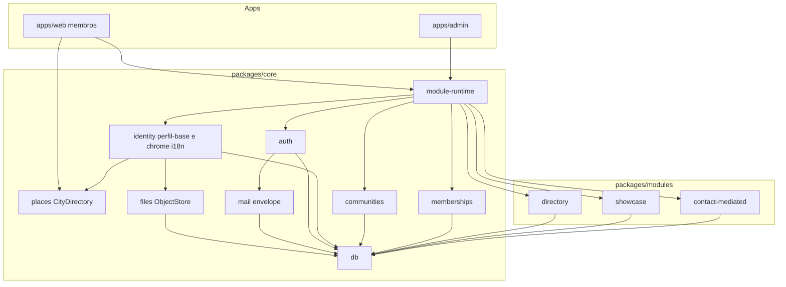

# 05 — System architecture

## Overview

**Community Platform** é server-first, multi-tenant, **plugin-first**. O núcleo não é “alumni”. É identidade + comunidades + membership + perfil-base. Features de diretório rico, vitrine e contato são módulos com manifest, schema próprio e flag por `community_id` (BuddyBoss/Moodle: componente instalado, enabled no contexto).

Duas apps Next no monorepo (`apps/web`, `apps/admin`), um Postgres. O Next de membros vive em `apps/web`.

## Architecture diagrams (Visual Set)

| File | Kind | Scope |
| ---- | ---- | ----- |
| `docs/architecture/diagrams/alumni-database.md` | database | ER SQL + catálogo `field_groups` / `fields` (skills ainda não existem em SQL) |
| `docs/architecture/diagrams/alumni-runtime.md` | runtime | `apps/web` e `apps/admin`, places, plugins, Postgres |
| `docs/architecture/diagrams/module-runtime.md` | flow | enable/disable por `community_id` → 404 se off |
| `docs/architecture/diagrams/plugin-contributions.md` | flow | registry + `listEnabled` → chrome/slots/campos |

## Architecture detail files

| File | Scope |
| ---- | ----- |
| `docs/architecture/surfaces.md` | web vs admin |
| `docs/architecture/monorepo.md` | Árvore de pastas |
| `docs/architecture/modules.md` | Contrato de plugin, perfil-base vs extra |
| `docs/architecture/profile-fields.md` | Catálogo de grupos/campos, templates, jsonb + GIN |
| `docs/architecture/list-surfaces.md` | Política de lista (diretório e vitrine): filtro e placement |
| `docs/architecture/plugin-surfaces.md` | Contribuições (registry + `module_id`); off = filtro genérico |
| `docs/architecture/media.md` | Avatar: store + chave; Postgres só URL |
| `docs/architecture/showcase-public.md` | O que a vitrine pode mostrar |
| `docs/architecture/data-access.md` | SQL → domínio → HTTP → UI; sem ORM; Query só no último hop |
| `docs/architecture/community-context.md` | Workspace: URL `/c/{slug}`, cookie, chrome; sem LIMIT 1 |
| `docs/architecture/email.md` | Template HTML único, slots, copy overlay, SMTP |
| `docs/architecture/ops-settings.md` | Plataforma vs tenant; criar pessoa; catálogo extra |

## System modules (core)

### Auth

OTP + JWT. Sem papel por e-mail. Corpo do e-mail: `docs/architecture/email.md` — envelope único + kinds; rotas não interpolam HTML.

### Identity (perfil-base)

Pessoa (`person_core`) e helpers de chrome (`pickContent`, cookie). Cidade é `GeoPlace` via `packages/core/places` (infraestrutura, **não** plugin). Foto: `docs/architecture/media.md` — ficheiro no ObjectStore, `avatar_url` só ponteiro. Headline e bio no plugin `directory` são os únicos textos que o membro preenche em pt-BR e en. O formulário de perfil é dirigido pelo **catálogo de campos** (`docs/architecture/profile-fields.md`): grupos, tipos com template, span 1–3. Availability é grupo do directory, não identidade.

### Communities e memberships

Tenant, papéis `member` / `coordinator`, `pending_approval`. Coordenação de entrada é **núcleo**.

Várias memberships `active` são o caso normal. A web resolve **uma** comunidade por request (`docs/architecture/community-context.md`): slug na URL, cookie nas APIs. `LIMIT 1` por `joined_at` não é contexto.

### Module runtime

Catálogo `plugin_core.modules`. Por comunidade: `network_core.community_modules (community_id, module_id, enabled)`. Comunidade nova e seed: first-party **inseridos** `enabled = true` (a coluna continua `DEFAULT false` para módulo sem row).

Montagem: **registry de contribuições** (rotas, chrome, slots) filtrado por `listEnabled`. Campos de perfil: `fields.module_id` (null = núcleo). Parser de catálogo não infere plugin. Detalhe: `docs/architecture/plugin-surfaces.md`.

### Operations (admin app)

Criar comunidade, pessoas da rede (listar **e criar** conta por e-mail), membership (papel, status, turma, remover), **ligar/desligar módulos**, catálogo de campos, **listas** (filtro e placement do diretório e da vitrine), **configuração da plataforma**, **configuração do tenant**, **e-mails** (um template + copy por kind). Detalhe: `docs/architecture/ops-settings.md`.

## First-party plugins (v2)

| Slug | O que adiciona | Off significa |
| ---- | -------------- | -------------- |
| `directory` | Catálogo de campos + card + busca/listagem | Membros só veem perfil-base (ou lista mínima do núcleo) |
| `showcase` | Projeção pública | Sem vitrine |
| `contact-mediated` | Formulário sem expor e-mail | Sem hiring mail |

## Profile field catalog

Detalhe: `docs/architecture/profile-fields.md` e `docs/architecture/list-surfaces.md`. Resumo: definições em `field_groups` / `fields`; política de cada lista em `list_fields`; valores custom em `cards.custom_attributes` (escalares, GIN); built-ins via `storage` `person` ou `card_column`; UI de perfil só orquestra grupos e `FieldControl` por tipo.

## Component boundary

1. App web registra contribuições e pergunta `listEnabled`; monta só o filtro.
2. Autorização no core; módulo não grava se `enabled = false`.
3. Isolamento `community_id` em toda query de rede — o id vem do contexto resolvido, não do último join.
4. Acesso a dados: `docs/architecture/data-access.md` — SQL na função de domínio, não no `useEffect`.

## Gate

`approved` — manager 2026-09-15. Inclui catálogo de campos do perfil e plugins first-party default on.
