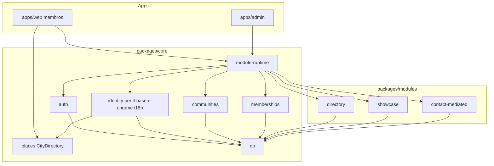

# 05 — System architecture

## Overview

**Community Platform** é server-first, multi-tenant, **plugin-first**. O núcleo não é “alumni”. É identidade + comunidades + membership + perfil-base. Features de diretório rico, vitrine e contato são módulos com manifest, schema próprio e flag por `community_id` (BuddyBoss/Moodle: componente instalado, enabled no contexto).

Duas apps Next no monorepo (`apps/web`, `apps/admin`), um Postgres. O Next de membros vive em `apps/web`.

## Architecture diagrams (Visual Set)

| File | Kind | Scope |
| ---- | ---- | ----- |
| `docs/architecture/diagrams/alumni-database.md` | database | ER núcleo (renomear quando o ficheiro for atualizado) |
| `docs/architecture/diagrams/alumni-runtime.md` | runtime | web vs admin |
| `docs/architecture/diagrams/module-runtime.md` | flow | enable/disable módulo |

## Architecture detail files

| File | Scope |
| ---- | ----- |
| `docs/architecture/surfaces.md` | web vs admin |
| `docs/architecture/monorepo.md` | Árvore de pastas |
| `docs/architecture/modules.md` | Contrato de plugin, perfil-base vs extra |
| `docs/architecture/i18n-content.md` | Packs + `CONTENT` no arquivo |

## System modules (core)

### Auth

OTP + JWT. Sem papel por e-mail.

### Identity (perfil-base)

Pessoa (`person_core`) e helpers de chrome (`pickContent`, cookie). Cidade é `GeoPlace` via `packages/core/places` (infraestrutura, **não** plugin). Headline e bio no plugin `directory` são os únicos textos que o membro preenche em pt-BR e en.

### Communities e memberships

Tenant, papéis `member` / `coordinator`, `pending_approval`. Coordenação de entrada é **núcleo**.

### Module runtime

Catálogo `plugin_core.modules`. Por comunidade: `network_core.community_modules (community_id, module_id, enabled)`. Resolve manifest, recusa rotas de plugin off.

### Operations (admin app)

Criar comunidade, atribuir coordenador, **ligar/desligar módulos**.

## First-party plugins (v2)

| Slug | O que adiciona | Off significa |
| ---- | -------------- | -------------- |
| `directory` | Campos extras + busca/listagem rica | Membros só veem perfil-base (ou lista mínima do núcleo) |
| `showcase` | Projeção pública | Sem vitrine |
| `contact-mediated` | Formulário sem expor e-mail | Sem hiring mail |

## Component boundary

1. App web pergunta ao runtime o que montar.
2. Autorização no core; módulo não grava se `enabled = false`.
3. Isolamento `community_id` em toda query de rede.

## Gate

`approved` — manager aprovou o modelo plugin + monorepo (2026-09-15).
