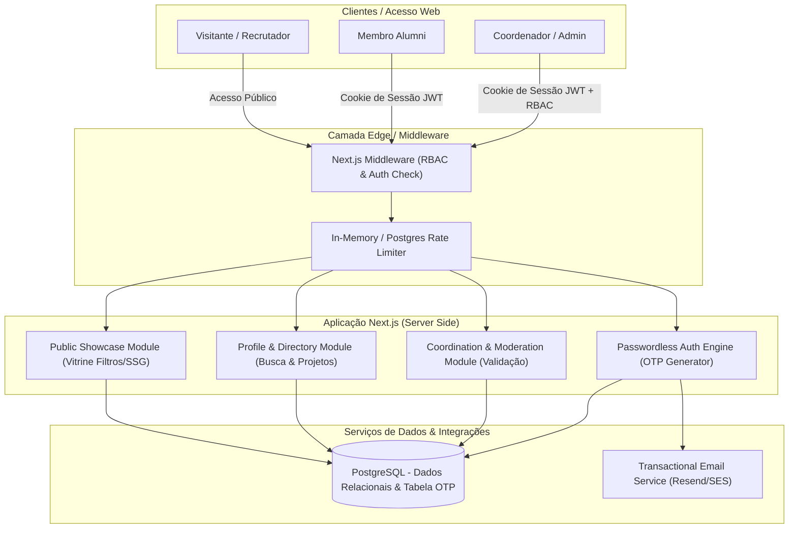

# 05 — System architecture

## Overview

O **Alumni Platform** adota uma arquitetura Server-First baseada em Next.js App Router (React Server Components + Server Actions / API Routes). O sistema centraliza a lógica de negócios, controle de acesso RBAC e proteções de privacidade no servidor antes de renderizar ou responder com dados.

## Architecture diagrams (Visual Set)

| File | Kind | Scope |
| ---- | ---- | ----- |
| `docs/architecture/diagrams/alumni-database.md` | database | Diagrama ER detalhado do banco de dados (Identity, PersonProfile, AlumniProfile e JSONB) |

## Simplificação de Infraestrutura (Decisão Simplificadora)

> **Decisão sobre o Redis:** Removido a dependência do Redis para a v1. Os códigos de verificação OTP e tentativas de login passam a ser armazenados na tabela dedicada `verification_tokens` no próprio **PostgreSQL** com expiração automática (`expires_at`). Isso simplifica o deploy local e em produção (único banco de dados para gerenciar).

## System Modules

### 1. Passwordless Auth Engine (`AuthService`)
- **Responsabilidade:** Geração de códigos numéricos de 6 dígitos (OTP) com expiração de 10 minutos gravados na tabela `verification_tokens` no PostgreSQL.
- **Validação:** Checagem de código com máximo de 5 tentativas. Ao validar, emite um JWT gravado em cookie HTTP-Only (`SameSite=Lax`, `Secure`).
- **Persistência:** Sessão mantida por 30 dias para usuários que marcarem a opção de manter conectado.

### 2. Profile & Directory Module (`ProfileDirectory`)
- **Responsabilidade:** Gestão do perfil do ex-aluno (habilidades, portfólio, projetos e disponibilidade).
- **Filtro de Privacidade:** Antes de entregar a resposta JSON ou HTML, filtra dados privados conforme o cargo do usuário solicitante (Alumni/Coord vêm dados completos; Guest só vê dados marcados como públicos).

### 3. Public Showcase Module (`PublicShowcase`)
- **Responsabilidade:** Exibição da vitrine para visitantes externos e contratantes.
- **Contato Mediado:** Formulário mediado onde a mensagem é disparada via e-mail transacional sem expor o e-mail real do ex-aluno ao público.

### 4. Coordination & Moderation Module (`CoordModule`)
- **Responsabilidade:** Painel exclusivo para os cargos `coordinator` e `admin`.
- **Funcionalidades:** Fila de aprovação de novos membros cadastrados, moderação/ocultação de perfis inapropriados e associação de ex-alunos a turmas/regiões.

## Component Boundary & Security Enforcements

1. **Server Components por padrão:** Dados sensíveis nunca chegam ao bundle JS do cliente. Apenas dados sanitizados são passados aos componentes de UI.
2. **Strict Server-Side Authorization:** Toda alteração de perfil ou ação administrativa valida o token e o papel (`role`) diretamente na instrução SQL / ORM, evitando autorização apenas na interface.
