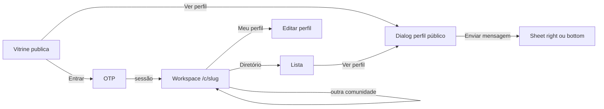
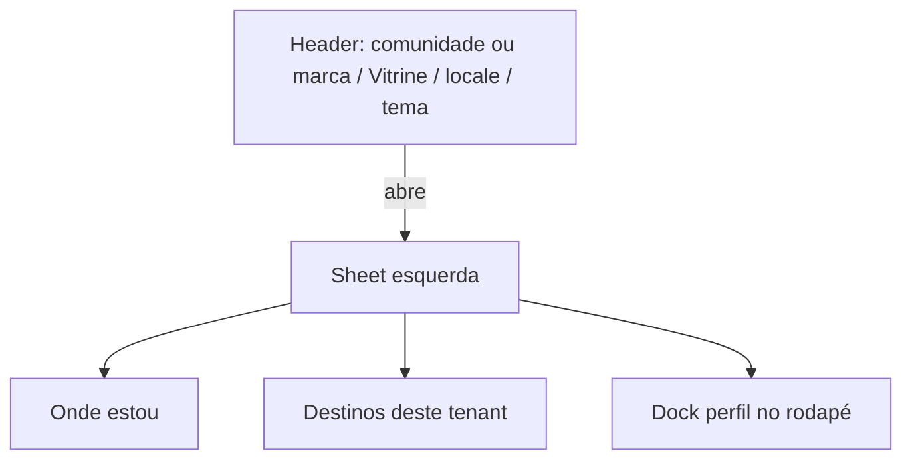

# 09 — Design system

## Overview

- **Surfaces:** `apps/web` (Stitch + plugins). Admin **não** usa o contrato Stitch; usa os mesmos primitives.
- **Primary UI stack:** `ts-shadcn` — primitives em `packages/ui/primitives` (`@community/ui`). Compostos membro em `packages/ui/member` e, hoje, `apps/web/src/components/{templates,app}/`.
- **Select / Checkbox:** shadcn em `@community/ui` (`SelectTrigger` + portal; `Checkbox` Radix). Sem `<select>` / `input[type=checkbox]` nas páginas. `Input` e `Textarea` nativos estilizados (contrato shadcn). Combobox de busca é `OpsCombobox`. `type=file` no avatar fica nativo de propósito.
- **Mood:** Directory-first, silêncio, institucional. Contraste com Circle: sem feed, badges rainbow, espaços aninhados. Workspace (trocar de comunidade) **não** é sidebar de espaços — ver `community-context.md`.
- **Reference HTML:** `docs/stitch/` — **não** é o contrato. Este arquivo é. HTML + capturas ilustram o alvo visual.

## Colors

Papel quente, não slate-50. Um acento só (`mark`) para Vitrine ativa e foco — não para pintar a UI.

| Token | Role | Light | Dark |
| ----- | ---- | ----- | ---- |
| `background` | Canvas | `#f3f0ea` | `#161412` |
| `surface` / `card` | Painéis | `#fffcf7` | `#221f1c` |
| `foreground` | Texto | `#1c1915` | `#f4f0e8` |
| `muted` | Texto secundário | `#5c564e` | `#c4b8a8` (não `#94a3b8`) |
| `border` | Divisores | `#ddd6cc` | `#3a342c` |
| `primary` | CTA | `#1f3d38` em `#f7f6f2` | `#d4cfc4` em `#1c1915` |
| `mark` | Sublinhado Vitrine / anel de foco | `#c45c26` | `#e08a4f` |
| `destructive` | Recusar | `#b91c1c` em `#fef2f2` | `#f87171` |

Arquivo: `packages/ui/primitives/src/styles.css`. Sem hex nas páginas.

## Theme modes

| Mode | When it applies | Token set / file |
| ---- | --------------- | ---------------- |
| Light | Padrão Stitch | `:root` em `packages/ui/primitives/src/styles.css` |
| Dark | Classe `.dark` + `next-themes` (`system` default) | Mesmo arquivo |

## Typography

Família única no produto: **IBM Plex Sans**. Motivo: o runtime hoje carrega `Atkinson_Hyperlegible` (2019) via `next/font` e declara `"Atkinson Hyperlegible Next"` no CSS **sem** ligar `--font-atkinson` / `--font-inter`. O resultado não é o contrato Stitch e não parece sistema institucional.

| Role | Use | Size / weight | Stack |
| ---- | --- | ------------- | ----- |
| `h1` | Título de tela | IBM Plex Sans semibold, 32px / 40px, tracking −0.02em | IBM Plex Sans |
| `h2` | Seções | IBM Plex Sans semibold, 24 / 32 | IBM Plex Sans |
| `h3` | Card / sheet | IBM Plex Sans semibold, 20 / 28 | IBM Plex Sans |
| `body` | Leitura | IBM Plex Sans 16–18px, line-height ≥ 1.5, ~65ch | IBM Plex Sans |
| `caption` | Chips / nav | IBM Plex Sans 14px medium | IBM Plex Sans |

Código: `next/font` `IBM_Plex_Sans` → `--font-body` e `--font-headline`. Sem mistura Inter + Atkinson. Sem `outline: none` sem anel de foco.

## Components (composed)

| Template | Purpose | Path today / alvo |
| -------- | ------- | ----------------- |
| `AppPageHeader` | Kicker + h1 + lede + actions | `packages/ui/member/src/app-page-header.tsx` |
| `AppPageTemplate` | Main + page header | `packages/ui/member/src/app-page-template.tsx` |
| `OpsPageHeader` / `OpsPageTemplate` | Mesmo contrato (kicker, h1, lede, actions, `nav`) no admin — **não** importa `@community/ui-member` | `packages/ui/admin/src/ops-page-*.tsx` |
| `OpsShell` | Rail contextual: rede = comunidades + pessoas; tenant = capítulos | `packages/ui/admin/src/ops-shell.tsx` |
| `OpsSubnav` | Tabs horizontais (legado / uso pontual; capítulos do tenant vão no rail) | `packages/ui/admin/src/ops-subnav.tsx` |
| `OpsSection` | Bloco h2 + lede dentro do workspace | `packages/ui/admin/src/ops-section.tsx` |
| `OpsBadge` | Rótulo curto (ex.: super-admin). Não cola no nome | `packages/ui/admin/src/ops-badge.tsx` |
| `OpsMoveButtons` | Ordem: `Button` `icon-sm` + seta, `aria-label` i18n. Sem “subir/descer” em texto. Desabilitado no extremo (não some). | `packages/ui/admin/src/ops-move-buttons.tsx` |
| `OpsCombobox` | Typeahead (listbox). Hits vêm do servidor; o componente não recebe 10k opções | `packages/ui/admin/src/ops-combobox.tsx` |
| `OpsTable` | Tabela densa ops | `packages/ui/admin/src/ops-table.tsx` |
| `AppAuthFrame` | Login centrado com kicker | `packages/ui/member/src/app-auth-frame.tsx` |
| `AppIndexList` / `AppPersonRow` | Índice de pessoas (não grid de cards) | `packages/ui/member/src/app-person-row.tsx` |
| `AppAlertDialog` | Confirmação (cancelar / confirmar) | `packages/ui/member/src/app-alert-dialog.tsx` |
| `AppSheet` | Painel lateral / fundo; body com `ScrollArea` | `packages/ui/member/src/app-sheet.tsx` |
| `AppShowcaseCard` | Cartão da vitrine (foto, headline, chips, Ver perfil) | `packages/ui/member/src/app-showcase-card.tsx` |
| `Toaster` (Sonner) | Feedback **transitório** (salvar, envio) | `packages/ui/primitives` — `toast` de `@community/ui`. Um `Toaster` no layout. **Não** usa `AppAlertTemplate` no topo da página para “salvo”. |
| `AppAlertTemplate` | Alerta **inline** (erro de campo, estado na tela) | `templates/AppAlertTemplate.tsx` |
| `MemberShell` | Sidebar + inset + header; páginas rolam com `ScrollArea`; rodapé no chrome (fora do scroll) | `apps/web/.../MemberShell.tsx` |
| `AppSidebar` | Destinos; rodapé = perfil + Sair | `apps/web/.../AppSidebar.tsx` |
| `AppCardTemplate` | Card genérico (legado; não usar em listas **nem** no formulário de perfil) | `templates/AppCardTemplate.tsx` |
| `AppProfileSection` / `AppProfileStack` | Seções do formulário de perfil (h2 + lede + campos; sem Card) | `packages/ui/member/src/app-profile-section.tsx` |
| `AppFormDock` | CTA Salvar grudado no fundo **só abaixo de sm** | mesmo ficheiro |
| `OtpCard` | OTP | `OtpCard.tsx` |

`AppNavbar.tsx` (barra ciano “Community”) é chrome morto / concorrente. Fora do contrato. Não redesenhar: remover na US de shell.

Não existe rota `/profile/:id`. O detalhe público é o `AppDialog` na vitrine.

## Screen flows

Navegação nomeada: **sidebar shadcn** no desktop (`collapsible=icon`; fechada = rail de ícones). **Sheet** só abaixo de 768px. Header: marca da **comunidade ativa** (membro no workspace) ou marca da plataforma (visitante) + Vitrine + locale + tema (`max-w-6xl`). Trigger de menu: primeiro item da sidebar no desktop; no header só abaixo de 768px. **Sair** abre `AppAlertDialog`.

Jobs: ver vitrine, pedir contato, entrar com código, escolher a comunidade, buscar pessoas, editar o próprio perfil, coordenar entrada. Super-admin (`/ops`, app admin) fica **fora** deste chrome.

| Tela (rota hoje) | Job | Quem | Chrome | Problema atual | Alvo visual (Stitch) |
| ----------------- | --- | ---- | ------ | -------------- | --------------------- |
| `/showcase` | Ver pessoas públicas | Visitante / membro | Header: Vitrine ativa | — | Cartões com headline + bio breve; diálogo do perfil |
| Perfil público | Ler perfil sanitizado | Visitante | `AppDialog` + `ScrollArea` | — | Headline no header; bio no body |
| Contato | Pedir contato mediado | Visitante | `AppSheet` right / bottom | Form dentro do diálogo | Sheet depois de Enviar mensagem |
| `/` | Entrar com OTP | Visitante | Mesmo header | OTP centrado | OTP centrado, um CTA |
| `/c/{slug}/directory` | Buscar membros **desta** comunidade | Membro | Sidebar: comunidade + Diretório | Path legado `/directory` | Lista em linhas; `Ver perfil` abre o mesmo diálogo da vitrine |
| `/c/{slug}/profile/edit` | Editar perfil-base + card deste tenant | Membro | Rodapé: Meu perfil | Path legado `/profile/edit` | Header sticky; identidade em superfície; grupos person / links |
| `/c/{slug}/coord/approvals` | Aprovar entrada **deste** tenant | Coordenador neste slug | Pedidos só se coord aqui | Path legado `/coord` | Tabela com Aprovar/Recusar rotulados |
| Switcher | Trocar de comunidade | Membro com 2+ assentos | Topo da sidebar; mobile = nome no header | LIMIT 1 invisível | Lista curta; sem ícones de servidor |
| `/ops`, admin | Operar tenants | Super-admin | Rail `--primary`; lista = **Rede / comunidades + pessoas**; tenant = + **nesta comunidade** | Um item “comunidades” com capítulos em tabs | App admin |

Estados obrigatórios por tela: loading (skeleton no grid/tabela), vazio (copy + ação), erro recuperável, blocked (403 coord / módulo desligado).

## Responsive behavior

| Breakpoint | Width | Behavior |
| ---------- | ----- | -------- |
| Mobile | `< 640px` | Uma coluna; header só Vitrine + locale + tema + menu; sheet 100% largura; hit 44px; sem overflow-x |
| Tablet | `640–1024px` | Lista de pessoas em uma coluna; filtros em sheet próprio |
| Desktop | `> 768px` | Sidebar; colapsada = rail de ícones + inicial da comunidade; páginas `max-w-6xl` |

## Accessibility baseline

WCAG 2.2 AA (AAA em body se possível). Foco 2px. Labels visíveis. Status não só por cor. `prefers-reduced-motion`. Erro ao lado do campo. Privacidade anunciável por leitor de tela. Detalhe: `docs/stitch/DESIGN.md`.

## Internationalization

| Item | Contract |
| ----- | -------- |
| Locales | `pt-BR` default e fallback; `en` segundo |
| RTL | _n/a_ nesta versão |
| Fonte das strings | Pack por componente + `CONTENT` no topo do arquivo — `docs/architecture/i18n-content.md` |
| Dump central | Proibido |
| Runtime | `createUiCatalog` em identity; não next-intl |
| Overlay | Porta pronta; SQL/UI ainda não |
| Switcher | Cookie `ui_locale`; `preferred_locale` no perfil-base |
| Datas/números | `Intl` com o locale resolvido |
| E-mail | Pack `core_web` (`email.otp.*`) |
| SEO hreflang | Fora até `12` existir |

## Showcase catalog

Rotas atuais (`/`, `/directory`, `/showcase`, `/profile/edit`, `/admin/approvals`) são **rascunho**. Catálogo Stitch: `docs/stitch/html/*.html` (exportação antiga, telas ocultas no canvas). Nova geração 2026-09-15: chrome slim + sheet. US de implementação só depois de `/review-us` em US de design.
