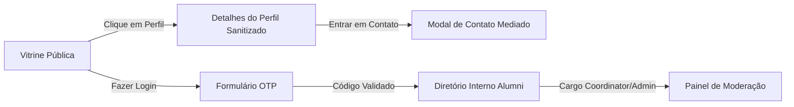

# 09 — Design system

## Overview

- **Surfaces:** Web app responsivo (Desktop, Tablet e Mobile).
- **Primary UI stack:** `ts-shadcn` / Tailwind CSS / Radix UI / Lucide Icons.
- **Mood:** Ferramenta profissional, limpa e confiável para conexões e oportunidades.

## Colors

| Token | Role | Theme key / CSS var |
| ----- | ---- | ------------------- |
| `primary` | Ações principais / botões CTA | `--primary` (#0f172a / Slate 900) |
| `background` | Canvas da página | `--background` (#f8fafc / Slate 50) |
| `foreground` | Texto principal | `--foreground` (#0f172a / Slate 900) |
| `muted` | Textos secundários e bordas sutis | `--muted-foreground` (#64748b / Slate 500) |
| `destructive` | Ações perigosas / rejeições | `--destructive` (#ef4444 / Red 500) |
| `border` | Divisores de cards e tabelas | `--border` (#e2e8f0 / Slate 200) |

## Theme modes

| Mode | When it applies | Token set / file |
| ---- | --------------- | ---------------- |
| Light | Padrão | `globals.css` |
| Dark | Seleção do usuário | `globals.css` (.dark class) |

## Typography

| Role | Use | Size / weight | Stack key |
| ---- | --- | ------------- | --------- |
| `h1` | Título da tela / Vitrine | 2.25rem (36px) / Bold | Sans (`Inter`) |
| `h2` | Seções do perfil e painéis | 1.5rem (24px) / SemiBold | Sans (`Inter`) |
| `body` | Conteúdo do perfil, bios e descrições | 1rem (16px) / Normal | Sans (`Inter`) |
| `caption` | Tags de habilidades e disponibilidade | 0.875rem (14px) / Medium | Sans (`Inter`) |

## Components (Composed Templates)

| Template | Purpose | Composed Path |
| -------- | ------- | ------------- |
| `AppProfileCard` | Exibição resumida do ex-aluno na vitrine/diretório | `components/app/AppProfileCard.tsx` |
| `AppContactModal` | Modal de envio de mensagem mediada ao alumni | `components/app/AppContactModal.tsx` |
| `AppOtpForm` | Formulário de solicitação e digitação do código OTP | `components/app/AppOtpForm.tsx` |
| `AppApprovalTable` | Tabela de moderação e aprovação da coordenação | `components/app/AppApprovalTable.tsx` |

## Screen flows

## Responsive behavior

| Breakpoint | Width | Behavior |
| ---------- | ----- | -------- |
| Mobile | `< 640px` | Menu hambúrguer; cards de perfil empilhados em coluna única |
| Tablet | `640px - 1024px` | Grid de 2 colunas para busca de perfis |
| Desktop | `> 1024px` | Grid de 3 colunas com filtros laterais fixos |
