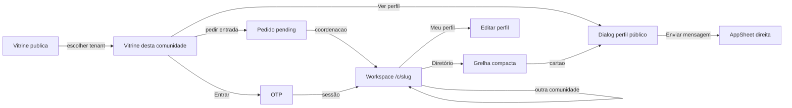
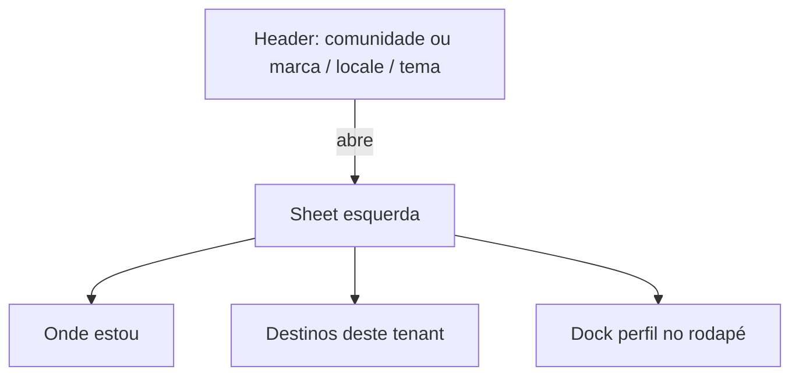

# 09 — Design system

## Overview

- **Surfaces:** `apps/web` (Stitch + plugins). Admin **não** usa o contrato Stitch; usa os mesmos primitives.
- **Primary UI stack:** `ts-shadcn` — primitives em `packages/ui/primitives` (`@community/ui`). Compostos membro em `packages/ui/member` e `apps/web/src/components/app/`.
- **Select / Checkbox / menu / slider / pagination / input-group:** shadcn em `@community/ui` via `pnpm ui:add` (`npx shadcn@latest add --cwd packages/ui/primitives`). `SelectTrigger` + portal; `DropdownMenu`; `Checkbox` Radix; `Slider`; `Pagination`; `InputGroup`; `Tabs`; `Accordion`. Sem `<select>` / `input[type=checkbox]` nas páginas. `Input` e `Textarea` nativos estilizados (contrato shadcn). Combobox de busca é `OpsCombobox`. `type=file` no avatar fica nativo de propósito. Primitives em `components/ui/*` não se personalizam; token (`--popover`) e compostos (`AppDialog`, `AppSheet`, `OpsSheet`, `OpsTabs`, `OpsAccordion`, `OpsHtmlPreview`) é que fecham o produto.
- **Mood:** Directory-first, silêncio, institucional. Contraste com Circle: sem feed, badges rainbow, espaços aninhados. Workspace (trocar de comunidade) **não** é sidebar de espaços — ver `community-context.md`.
- **Copy:** ver secção Copy. Formulário: grupo = título. Campo = rótulo + **Obrigatório** ou **Opcional** (os dois estados, sempre), no mesmo eixo do nome.
- **Catálogo (ops):** o grupo é o único card (`OpsAccordion`). Campos e opções = linhas, não caixa dentro de caixa. **Adicionar campo** e **editar campo** abrem `OpsSheet` à direita (mesmo contrato de `AppSheet`); adicionar fica no cabeçalho do grupo. Ações do grupo e da linha são `OpsIconButton` (`icon-sm` + tooltip no hover + `aria-label`). Não expande a linha. Checkbox avulso (`OpsCheckboxFrame`) usa o mesmo recorte do select.
- **Motion:** sidebar desktop = `transition-[width]`. Overlay shadcn (`Sheet`, dialog, select) via `@import "tw-animate-css"` no `globals.css` das apps.
- **Filtros (diretório e vitrine):** busca na página; turma do diretório ao lado da busca. Abaixo de `lg`, país/cidade/raio entram no `AppFilterSheet` à direita, com os afinadores (`attr.*`, disponibilidade). Em `lg+`, lugar fica na página; o sheet fica só para afinadores (e some se não houver nenhum).
- **Prévia de campos (ops):** botão **Como fica** no grupo; a silhueta abre num `OpsDialog` (tela larga). Não fica inline no cartão. `localized_text` = dois controles com legenda de locale, não dois campos.
- **Reference HTML:** `docs/stitch/` — **não** é o contrato. Este arquivo é. HTML + capturas ilustram o alvo visual.

## Colors

Papel quente, não slate-50. Um acento só (`mark`) para Vitrine ativa e foco — não para pintar a UI.

| Token | Role | Light | Dark |
| ----- | ---- | ----- | ---- |
| `background` | Canvas | `#f3f0ea` | `#161412` |
| `surface` / `card` | Painéis | `#fffcf7` | `#221f1c` |
| `popover` | Overlay shadcn (Select, menus) | `#fffcf7` | `#221f1c` |
| `foreground` | Texto | `#1c1915` | `#f4f0e8` |
| `muted` | Texto secundário | `#5c564e` | `#c4b8a8` (não `#94a3b8`) |
| `border` | Divisores | `#ddd6cc` | `#3a342c` |
| `primary` | CTA | `#1f3d38` em `#f7f6f2` | `#d4cfc4` em `#1c1915` |
| `mark` | Sublinhado Vitrine / anel de foco | `#c45c26` | `#e08a4f` |
| `destructive` | Recusar | `#b91c1c` em `#fef2f2` | `#f87171` |

Arquivo: `packages/ui/primitives/src/styles.css`. Sem hex nas páginas.

## Theme modes

| Mode | When it applies | Token set / file |
| ---- | --------------- | ---------------- |
| Light | Padrão Stitch | `:root` em `packages/ui/primitives/src/styles.css` |
| Dark | Classe `.dark` no `<html>` (`system` default). `next/script` `beforeInteractive` no layout; toggle no client | Mesmo arquivo |

## Typography

Família única no produto: **IBM Plex Sans**. Motivo: o runtime hoje carrega `Atkinson_Hyperlegible` (2019) via `next/font` e declara `"Atkinson Hyperlegible Next"` no CSS **sem** ligar `--font-atkinson` / `--font-inter`. O resultado não é o contrato Stitch e não parece sistema institucional.

| Role | Use | Size / weight | Stack |
| ---- | --- | ------------- | ----- |
| `h1` | Título de tela | IBM Plex Sans semibold, 32px / 40px, tracking −0.02em | IBM Plex Sans |
| `h2` | Seções | IBM Plex Sans semibold, 24 / 32 | IBM Plex Sans |
| `h3` | Card / sheet | IBM Plex Sans semibold, 20 / 28 | IBM Plex Sans |
| `body` | Leitura | IBM Plex Sans 16–18px, line-height ≥ 1.5, ~65ch | IBM Plex Sans |
| `caption` | Chips / nav | IBM Plex Sans 14px medium | IBM Plex Sans |

Código: `next/font` `IBM_Plex_Sans` → `--font-body` e `--font-headline`. Sem mistura Inter + Atkinson. Sem `outline: none` sem anel de foco.

## Components (composed)

| Template | Purpose | Path today / alvo |
| -------- | ------- | ----------------- |
| `AppPageHeader` | Kicker + h1 + lede + actions | `packages/ui/member/src/app-page-header.tsx` |
| `AppPageTemplate` | Main + page header | `packages/ui/member/src/app-page-template.tsx` |
| `OpsPageHeader` / `OpsPageTemplate` | Mesmo contrato (kicker, h1, lede, actions, `nav`) no admin — **não** importa `@community/ui-member` | `packages/ui/admin/src/ops-page-*.tsx` |
| `OpsShell` | Rail contextual: rede = comunidades + pessoas; tenant = capítulos; páginas rolam com `ScrollArea` (header fora do scroll) | `packages/ui/admin/src/ops-shell.tsx` |
| `OpsSubnav` | Tabs horizontais de **rota** (legado / uso pontual; capítulos do tenant vão no rail) | `packages/ui/admin/src/ops-subnav.tsx` |
| `OpsTabs` | Tabs shadcn de **estado** (ex.: kinds de e-mail). Horizontal por padrão: irmãos do mesmo formulário, sem segundo rail. Vertical só se a lista for longa e o conteúdo for um só painel. | `packages/ui/admin/src/ops-tabs.tsx` |
| `OpsAccordion` | Item colapsável (shadcn `Accordion` `single` + `collapsible`). Fecha por padrão. Título no gatilho; ações (botões) **fora** do gatilho para não aninhar botão. **Uma** caixa (`rounded-lg border`); aberto = linha sob o cabeçalho. Sem card dentro do card. | `packages/ui/admin/src/ops-accordion.tsx` |
| `OpsCheckboxFrame` | Checkbox sozinho (ex.: filtrar numa lista) no mesmo recorte de `SelectTrigger`: borda, `h-9`, controle no centro | `packages/ui/admin/src/ops-checkbox-frame.tsx` |
| `OpsHtmlPreview` | Iframe de HTML (e-mail). Atualiza `head`/`body` no documento já aberto; não troca `srcDoc` a cada tecla. | `packages/ui/admin/src/ops-html-preview.tsx` |
| `OpsDialog` | Overlay de detalhe (mesmo contrato de `AppDialog`). Admin **não** importa `@community/ui-member`. Prévia de campos abre aqui. | `packages/ui/admin/src/ops-dialog.tsx` |
| `OpsSheet` | Mesmo contrato de `AppSheet` (`SheetTrigger` + `SheetContent` + `SheetClose`). Corpo com scroll. Editar campo do catálogo abre à direita. Admin **não** importa `@community/ui-member`. | `packages/ui/admin/src/ops-sheet.tsx` |
| `OpsAlertDialog` | Confirmação destrutiva (mesmo contrato de `AppAlertDialog`). Admin **não** importa `@community/ui-member`. Excluir abre isto; desativar não. | `packages/ui/admin/src/ops-alert-dialog.tsx` |
| `OpsSection` | Bloco h2 + lede no workspace (**sem Card**; igual `AppProfileSection`). Card = tabela, lista de pessoas, ou **acordeão do grupo**. Campos e opções dentro do grupo são **linhas** (`divide-y`), não caixas de 4 bordas | `packages/ui/admin/src/ops-section.tsx` |
| `OpsBadge` | Rótulo curto (ex.: super-admin). Não cola no nome | `packages/ui/admin/src/ops-badge.tsx` |
| `OpsMoveButtons` | Ordem: `OpsIconButton` + seta. Sem “subir/descer” em texto. Desabilitado no extremo (não some). | `packages/ui/admin/src/ops-move-buttons.tsx` |
| `OpsIconButton` | Ação densa: `Button` `icon-sm` + tooltip (label no hover) + `aria-label`. | `packages/ui/admin/src/ops-icon-button.tsx` |
| `OpsCombobox` | Typeahead (listbox). Hits vêm do servidor; o componente não recebe 10k opções | `packages/ui/admin/src/ops-combobox.tsx` |
| `OpsTable` | Tabela densa ops | `packages/ui/admin/src/ops-table.tsx` |
| `AppAuthFrame` | Login centrado com kicker | `packages/ui/member/src/app-auth-frame.tsx` |
| `AppIndexList` / `AppPersonRow` | Índice denso (ops / listas que ainda não são grelha) | `packages/ui/member/src/app-person-row.tsx` |
| `AppAlertDialog` | Confirmação (cancelar / confirmar) | `packages/ui/member/src/app-alert-dialog.tsx` |
| `AppDialog` | Perfil / detalhe: header e footer fora do scroll; body é `ScrollArea` shadcn com viewport `overflow-y: scroll` limitado (`app-dialog-scroll`) | `packages/ui/member/src/app-dialog.tsx` |
| `AppSheet` | Sheet shadcn: `SheetTrigger` + `SheetContent` + `SheetClose`. Corpo `grid flex-1 auto-rows-min gap-6 px-4`. Filtros e enviar mensagem usam este template. | `packages/ui/member/src/app-sheet.tsx` |
| `AppFilterSheet` | `AppSheet` com trigger na página, limpar e fechar no rodapé | `packages/ui/member/src/app-filter-sheet.tsx` |
| `AppPublicChrome` | Página pública da vitrine: header sem sidebar, documento rola | `packages/ui/member/src/app-public-chrome.tsx` |
| `AppShowcasePortal` / `AppShowcasePager` | Herói do portal público + paginação das listas de pessoas (primitive `Pagination` shadcn + `Select` 24/48/96; acima e abaixo da grelha) | `packages/ui/member/src/app-showcase-portal.tsx` |
| `AppPersonFieldGroup` | Rótulo do campo + valores em chips (vitrine, diálogo) | `packages/ui/member/src/app-person-field-group.tsx` |
| `AppPersonCard` / `AppShowcaseCard` | Cartão de pessoa. `compact` = diretório (foto 64px, headline, idiomas e disponibilidade sem bio). `teaser` (`AppShowcaseCard`) = vitrine (foto 80px, bio, extras com label). Cartão inteiro abre o perfil | `packages/ui/member/src/app-showcase-card.tsx` |
| `Toaster` (Sonner) | Feedback **transitório** (salvar, envio) | `packages/ui/primitives` — `toast` de `@community/ui`. Um `Toaster` no layout. Alerta **inline** = `Alert` de `@community/ui`, não toast. |
| `MemberShell` | Sidebar + inset + header; páginas rolam com `ScrollArea`; rodapé no chrome (fora do scroll) | `apps/web/.../MemberShell.tsx` |
| `AppSidebar` | Destinos desta comunidade; rodapé = perfil + Sair | `apps/web/.../AppSidebar.tsx` |
| `CommunitySwitcher` | Troca de tenant no header da sidebar (dropdown se 2+) | `apps/web/.../CommunitySwitcher.tsx` |
| `AppProfileSection` / `AppProfileStack` | Seções do formulário de perfil (h2 + lede + campos; sem Card) | `packages/ui/member/src/app-profile-section.tsx` |
| `AppFormDock` | CTA Salvar grudado no fundo **só abaixo de sm** | mesmo ficheiro |
| `OtpCard` | OTP | `OtpCard.tsx` |

Chrome: **Workspace** = `MemberShell` + `AppSidebar`. Header do workspace: menu + marca da comunidade + locale + tema; a barra de links fica vazia por agora (vitrine só na sidebar). **Vitrine** pública = `AppPublicChrome` (sem sidebar). Sem barra ciano “Community”. Com `DATABASE_READ_ONLY=1`, uma faixa (`DemoRibbon`) no `layout` raiz da web e do admin, **fixa** acima de qualquer header (o documento não faz scroll por cima dela). Na faixa: web liga para o admin (`NEXT_PUBLIC_OPS_URL`); admin liga para o site (`NEXT_PUBLIC_APP_URL`).

Não existe rota `/profile/:id`. O detalhe público é o `AppDialog` na vitrine.

## Screen flows

Navegação do **workspace**: sidebar shadcn no desktop; header sem destinos de plugin por agora. **Vitrine**: sem menu hamburger; header com marca + Entrar ou Comunidade + locale + tema.

| Tela (rota hoje) | Job | Quem | Chrome | Problema atual | Alvo visual (Stitch) |
| ----------------- | --- | ---- | ------ | -------------- | --------------------- |
| `/showcase` | Portal público | Visitante / membro | `AppPublicChrome` | Sidebar no visitante | Herói admin + cartões; CTA Entrar |
| `/c/{slug}/showcase` | Homepage pública desta comunidade | Visitante / membro | `AppPublicChrome` | Página interna | Título/texto do admin; sem sidebar |
| Perfil público | Ler perfil sanitizado | Visitante | `AppDialog` + `ScrollArea` | — | Nome no header; tagline + bio no body; extras na coluna |
| Contato | Pedir contato mediado | Visitante | `AppSheet` (mesmo template dos filtros) | Form no `AppDialog` | Trigger **Enviar mensagem**; sheet com nome, e-mail e mensagem obrigatórios (mensagem ≥ 40), telefone opcional; CTA **Enviar** passa a **Enviando…** e fica `disabled` até a resposta |
| `/` | Ver assentos e comunidades públicas | Visitante / membro | Header da plataforma | — | Lista de tenants; OTP fica em `/login` |
| `/login` | Entrar com OTP | Visitante | `AppPublicChrome` | Sidebar no OTP | OTP centrado, um CTA |
| `/c/{slug}/directory` | Buscar membros **desta** comunidade | Membro | Sidebar: comunidade + Diretório | Path legado `/directory` | Grelha de `AppPersonCard` compacto; filtros de país/cidade; raio em slider (25–3000 km); `AppShowcasePager` só na grelha; toggle mapa se o plugin `map` estiver on (até 5000 pins); pin = foto/iniciais com agrupamento; o cartão (ou o pin) abre o mesmo diálogo da vitrine. Overlay Radix (`z-50`) fica acima do mapa porque o Leaflet não vaza z-index para o documento |
| `/c/{slug}/profile` | Card e campos desta comunidade | Membro | Nesta comunidade | Misturado com identidade | Formulário só `storage` ≠ `person` |
| `/profile` | Editar identidade | Membro | Rodapé: Meu perfil | Path legado `/profile/edit` | Nome, foto, cidade, links |
| `/c/{slug}/coord/approvals` | Aprovar entrada **deste** tenant | Coordenador neste slug | Pedidos só se coord aqui | Path legado `/coord` | Tabela com Aprovar/Recusar rotulados |
| Switcher | Trocar de comunidade | Membro com 2+ assentos | Header da sidebar (`CommunitySwitcher`); trigger de rail no header da página | LIMIT 1 invisível | Dropdown; sem ícones de servidor |
| `/ops`, admin | Operar tenants | Super-admin | Rail `--primary`; lista = **Rede / comunidades + pessoas**; tenant = + **nesta comunidade** | Um item “comunidades” com capítulos em tabs | App admin |

Estados obrigatórios por tela: loading (skeleton no grid/tabela), vazio (copy + ação), erro recuperável, blocked (403 coord / módulo desligado).

## Responsive behavior

| Breakpoint | Width | Behavior |
| ---------- | ----- | -------- |
| Mobile | `< 640px` | Uma coluna; header = menu + marca + locale + tema (sem links); sheet 100% largura; hit 44px; sem overflow-x |
| Tablet | `640–1024px` | Grelha de pessoas em duas colunas; país/cidade/raio e afinadores no `AppFilterSheet` à direita |
| Desktop | `> 768px` | Sidebar; colapsada = rail de ícones + inicial da comunidade; páginas `max-w-6xl`; grelha em três colunas; filtros continuam no sheet à direita (não rail esquerdo) |

## Copy

Voz institucional, curta, em sentence case. **Kicker, título e subtítulo são chrome da página: preenchem.** String vazia some da tela — não use vazio para “ficar limpo”.

| Superfície | O que escreve | O que não escreve |
| ---------- | ------------- | ----------------- |
| Kicker | Onde a pessoa está (`Início`, `Membros`, `Coordenação`, `Rede`) | Slogan |
| Título | Nome da tela; na vitrine = `settings.showcase_title` (ou o nome da comunidade) | Pitch (“encontre a rede”) |
| Subtítulo | Uma frase de contexto; na vitrine = `settings.showcase_description` | Tutorial, schema, “para quem ainda não é membro” |
| Campo | Rótulo + obrigatório/opcional | Lede que ensina schema |
| Ajuda | Uma frase se o controlo for ambíguo | Env vars, papéis internos |
| Empty | Vitrine sem cartões: título + uma frase (`AppShowcaseEmpty`). Casa sem opt-in ≠ busca/filtro sem resultado | “Carregando…”, grelha vazia, uma linha miúda no canto |
| Privacidade | Só no sheet **enviar mensagem**: a mensagem vai para a pessoa (com o nome). Login não leva nota de vitrine | Ensaio no diretório, no header, ou “o e-mail não aparece” |
| Demo (`DATABASE_READ_ONLY`) | Faixa fixa; web `/login` com `member01@demo.example` + Entrar; admin `/login` com a conta de seed ops + Entrar (sem OTP); write em `/api` abre diálogo; faixa com link para a outra superfície | `DEMO=1`, snapshot, um `if` por botão |

Proibido na UI (docs e logs podem): intermediado, tenant, membership, schema, demografia, headline, `super_admin`, `SMTP_HOST`, Mailpit, “no banco”, slug como aula. Ops pode ver **identificador na URL**. Membro e visitante: o produto. Ops: a operação, ainda humano.

## Email

Transacional, não marketing. **Um** template para todos os kinds (`docs/architecture/email.md`, `layout.ts`). Tokens **iguais** à tabela Colors, em hex **inline**. Tipografia: **IBM Plex Sans** no `font-family` inline, fallback Helvetica Neue / Arial (clientes de e-mail raramente carregam Google Fonts). Título e corpo **centrados**; recado alinhado à esquerda num bloco estreito. Largura 600px; no telemóvel a tabela encolhe (`max-width: 100%`). Código OTP em cartão `#f7f6f2`, mono ≥ 24px. CTA em `primary` (`#1f3d38` / `#f7f6f2`). Sem imagem de fundo. Admin: `OpsTabs` horizontais por kind (não Select); copy default já no formulário.

## Accessibility baseline

WCAG 2.2 AA (AAA em body se possível). Foco 2px. Labels visíveis. Status não só por cor. `prefers-reduced-motion`. Erro ao lado do campo. Privacidade anunciável por leitor de tela. Detalhe: `docs/stitch/DESIGN.md`.

## Internationalization

| Item | Contract |
| ----- | -------- |
| Locales | `pt-BR` default e fallback; `en` segundo |
| RTL | _n/a_ nesta versão |
| Fonte das strings | Pack por componente + `CONTENT` no topo do arquivo — `docs/architecture/i18n-content.md` |
| Dump central | Proibido |
| Runtime | `createUiCatalog` em identity; não next-intl |
| Overlay | Porta pronta; SQL/UI ainda não |
| Switcher | Cookie `ui_locale`; `preferred_locale` no perfil-base |
| Datas/números | `Intl` com o locale resolvido |
| E-mail | Template único (`layout.ts`) + copy overlay; chrome da tela em `core_admin` |
| SEO hreflang | Fora até `12` existir |

## Showcase catalog

Rotas atuais: `/`, `/login`, `/showcase`, `/c/{slug}/directory|showcase|profile/edit|coord/approvals`. Paths sem slug redirecionam. Admin é `apps/admin`, não `/admin/approvals`. Catálogo Stitch: `docs/stitch/html/*.html`.
