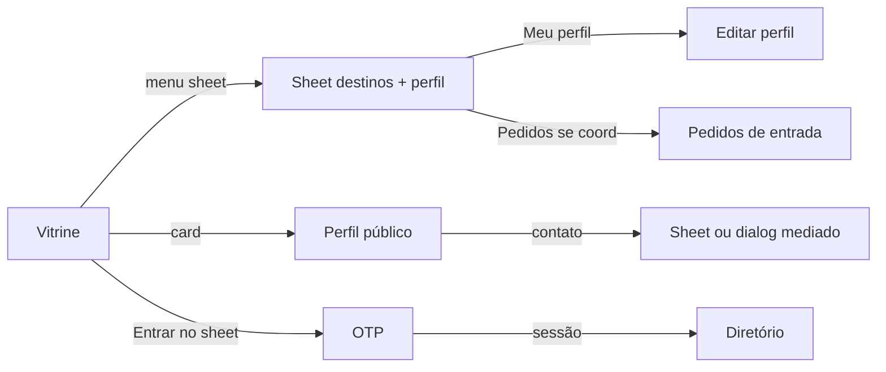
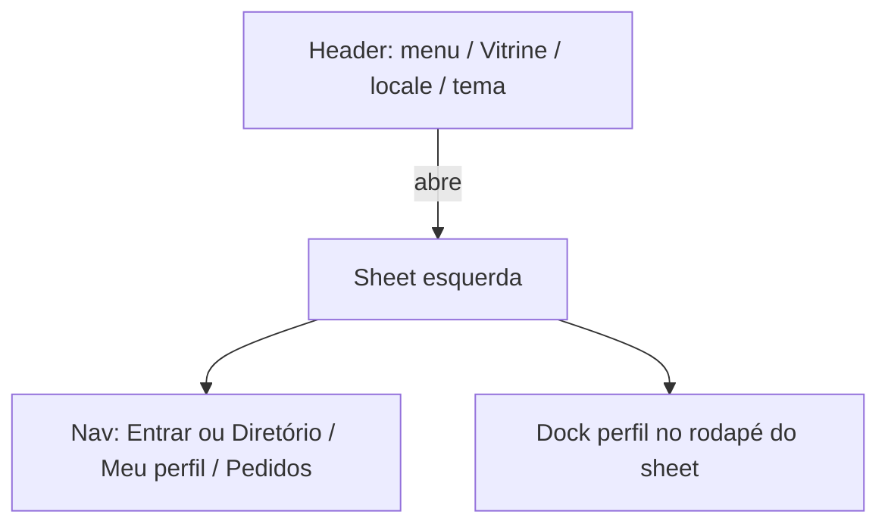

# 09 — Design system

## Overview

- **Surfaces:** `apps/web` (Stitch + plugins). Admin **não** usa o contrato Stitch; usa os mesmos primitives.
- **Primary UI stack:** `ts-shadcn` — primitives em `packages/ui/primitives` (`@community/ui`). Compostos membro em `packages/ui/member` e, hoje, `apps/web/src/components/{templates,app}/`.
- **Mood:** Directory-first, silêncio, institucional. Contraste com Circle: sem feed, badges rainbow, sidebars de comunidade.
- **Reference HTML:** `docs/stitch/` — **não** é o contrato. Este arquivo é. HTML + capturas ilustram o alvo visual.

## Colors

Papel quente, não slate-50. Um acento só (`mark`) para Vitrine ativa e foco — não para pintar a UI.

| Token | Role | Light | Dark |
| ----- | ---- | ----- | ---- |
| `background` | Canvas | `#f3f0ea` | `#161412` |
| `surface` / `card` | Painéis | `#fffcf7` | `#221f1c` |
| `foreground` | Texto | `#1c1915` | `#f4f0e8` |
| `muted` | Texto secundário | `#5c564e` | `#c4b8a8` (não `#94a3b8`) |
| `border` | Divisores | `#ddd6cc` | `#3a342c` |
| `primary` | CTA | `#1f3d38` em `#f7f6f2` | `#d4cfc4` em `#1c1915` |
| `mark` | Sublinhado Vitrine / anel de foco | `#c45c26` | `#e08a4f` |
| `destructive` | Recusar | `#b91c1c` em `#fef2f2` | `#f87171` |

Arquivo: `packages/ui/primitives/src/styles.css`. Sem hex nas páginas.

## Theme modes

| Mode | When it applies | Token set / file |
| ---- | --------------- | ---------------- |
| Light | Padrão Stitch | `:root` em `packages/ui/primitives/src/styles.css` |
| Dark | Classe `.dark` + `next-themes` (`system` default) | Mesmo arquivo |

## Typography

Família única no produto: **IBM Plex Sans**. Motivo: o runtime hoje carrega `Atkinson_Hyperlegible` (2019) via `next/font` e declara `"Atkinson Hyperlegible Next"` no CSS **sem** ligar `--font-atkinson` / `--font-inter`. O resultado não é o contrato Stitch e não parece sistema institucional.

| Role | Use | Size / weight | Stack |
| ---- | --- | ------------- | ----- |
| `h1` | Título de tela | IBM Plex Sans semibold, 32px / 40px, tracking −0.02em | IBM Plex Sans |
| `h2` | Seções | IBM Plex Sans semibold, 24 / 32 | IBM Plex Sans |
| `h3` | Card / sheet | IBM Plex Sans semibold, 20 / 28 | IBM Plex Sans |
| `body` | Leitura | IBM Plex Sans 16–18px, line-height ≥ 1.5, ~65ch | IBM Plex Sans |
| `caption` | Chips / nav | IBM Plex Sans 14px medium | IBM Plex Sans |

Código: `next/font` `IBM_Plex_Sans` → `--font-body` e `--font-headline`. Sem mistura Inter + Atkinson. Sem `outline: none` sem anel de foco.

## Components (composed)

| Template | Purpose | Path today / alvo |
| -------- | ------- | ----------------- |
| `AppPageHeader` | Kicker + h1 + lede + actions | `packages/ui/member/src/app-page-header.tsx` |
| `AppPageTemplate` | Main + page header | `packages/ui/member/src/app-page-template.tsx` |
| `AppAuthFrame` | Login centrado com kicker | `packages/ui/member/src/app-auth-frame.tsx` |
| `AppIndexList` / `AppPersonRow` | Índice de pessoas (não grid de cards) | `packages/ui/member/src/app-person-row.tsx` |
| `AppAlertDialog` | Confirmação (cancelar / confirmar) | `packages/ui/member/src/app-alert-dialog.tsx` — primitive `alert-dialog` via CLI |
| `MemberShell` | Sidebar + inset + header | `apps/web/.../MemberShell.tsx` |
| `AppSidebar` | Destinos; rodapé = perfil + Sair | `apps/web/.../AppSidebar.tsx` |
| `AppCardTemplate` | Card genérico (legado; não usar em listas) | `templates/AppCardTemplate.tsx` |
| `OtpCard` | OTP | `OtpCard.tsx` |

`AppNavbar.tsx` (barra ciano “Community”) é chrome morto / concorrente. Fora do contrato. Não redesenhar: remover na US de shell.

Não existe `AppProfileCard` ainda. US de design cria compostos a partir do Stitch, sem editar primitives.

## Screen flows

Navegação nomeada: **sidebar shadcn** no desktop (`collapsible=icon`; fechada = rail de ícones). **Sheet** só abaixo de 768px. Header: trigger + Vitrine + locale + tema. Conteúdo: `max-w-6xl`. **Sair** abre `AppAlertDialog` (não logout imediato).

Jobs: ver vitrine, pedir contato, entrar com código, buscar pessoas, editar o próprio perfil, coordenar entrada. Super-admin (`/ops`, app admin) fica **fora** deste chrome.

| Tela (rota hoje) | Job | Quem | Chrome | Problema atual | Alvo visual (Stitch) |
| ----------------- | --- | ---- | ------ | -------------- | --------------------- |
| `/showcase` | Ver pessoas públicas | Visitante / membro | Header slim; sheet com Entrar ou perfil | Cards crus, dialog genérico, header com “voltar” + e-mail | Vitrine com cards (foto, headline, chips, Ver perfil) |
| `/` | Entrar com OTP | Visitante | Mesmo header; sheet = Entrar destacado | Header especial com “voltar”; parece outra marca | OTP centrado, um CTA |
| `/directory` | Buscar membros | Membro | Sheet: Diretório ativo | Busca sem hierarquia; aside de privacidade sem filtro real; sem “Ver perfil” | Grid + rail de filtro; empty state |
| `/profile/edit` | Editar perfil-base | Membro | Sheet: dock de perfil + Meu perfil | Form único sem seções; URL de avatar crua | Identidade / diretório / locale em blocos |
| Perfil público (rota ausente) | Ler perfil sanitizado | Visitante | Sheet visitante | **Não existe** — contato dispara da lista | Página de detalhe + CTA Solicitar contato |
| Contato (dialog/sheet) | Pedir contato mediado | Visitante | Overlay; não empilhar sheet de nav | Inputs nativos, hex no erro | Sheet direita ou dialog; copy de mediação |
| `/coord/approvals` | Aprovar entrada | Coordenador | Sheet: + Pedidos | Tabela mínima; header “Coordenação” paralelo | Tabela com Aprovar/Recusar rotulados |
| `/ops`, admin | Operar tenants | Super-admin | **Não** usa Stitch | Fora desta pass | App admin |

Estados obrigatórios por tela: loading (skeleton no grid/tabela), vazio (copy + ação), erro recuperável, blocked (403 coord / módulo desligado).

## Responsive behavior

| Breakpoint | Width | Behavior |
| ---------- | ----- | -------- |
| Mobile | `< 640px` | Uma coluna; header só Vitrine + locale + tema + menu; sheet 100% largura; hit 44px; sem overflow-x |
| Tablet | `640–1024px` | Lista de pessoas em uma coluna; filtros em sheet próprio |
| Desktop | `> 768px` | Sidebar; colapsada só o logo; páginas `max-w-6xl` |

## Accessibility baseline

WCAG 2.2 AA (AAA em body se possível). Foco 2px. Labels visíveis. Status não só por cor. `prefers-reduced-motion`. Erro ao lado do campo. Privacidade anunciável por leitor de tela. Detalhe: `docs/stitch/DESIGN.md`.

## Internationalization

| Item | Contract |
| ----- | -------- |
| Locales | `pt-BR` default e fallback; `en` segundo |
| RTL | _n/a_ nesta versão |
| Fonte das strings | Objeto `CONTENT` no **topo** de cada arquivo de UI — `docs/architecture/i18n-content.md` |
| Dump central | Proibido. Chrome = `CONTENT` + `pickContent` |
| Switcher | Persistido em `preferred_locale` no perfil-base; cookie/header na sessão |
| Datas/números | `Intl` com o locale resolvido |
| E-mail | `CONTENT` no arquivo do template |
| SEO hreflang | Fora até `12` existir |

## Showcase catalog

Rotas atuais (`/`, `/directory`, `/showcase`, `/profile/edit`, `/admin/approvals`) são **rascunho**. Catálogo Stitch: `docs/stitch/html/*.html` (exportação antiga, telas ocultas no canvas). Nova geração 2026-09-15: chrome slim + sheet. US de implementação só depois de `/review-us` em US de design.
