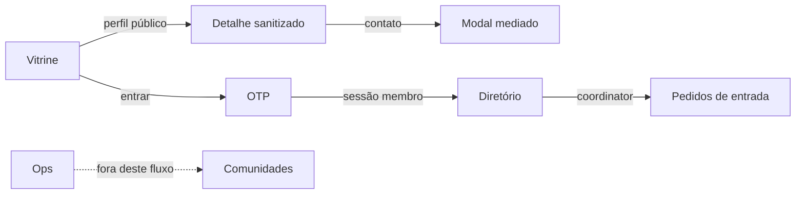

# 09 — Design system

## Overview

- **Surfaces:** `apps/web` (Stitch + plugins). Admin **não** usa o contrato Stitch; usa os mesmos primitives.
- **Primary UI stack:** `ts-shadcn` — primitives em `packages/ui/primitives` (`@community/ui`). Compostos membro em `packages/ui/member` e, hoje, `apps/web/src/components/{templates,app}/`.
- **Mood:** Directory-first, silêncio, institucional. Contraste com Circle: sem feed, badges rainbow, sidebars de comunidade.
- **Reference HTML:** `docs/stitch/` — **não** é o contrato. Este arquivo é. HTML + capturas ilustram o alvo visual.

## Colors

Light: Stitch. Dark: `.dark` no mesmo arquivo. Utilities (`bg-background`) leem `var(--background)`, não hex no `@theme`.

| Token | Role | Theme key / CSS var |
| ----- | ---- | ------------------- |
| `background` | Canvas | `--background` `#f8fafc` |
| `surface` | Cards | `#ffffff` |
| `foreground` | Texto | `--foreground` `#0f172a` |
| `muted` | Texto secundário | `#475569` |
| `border` | Bordas | `--border` `#e2e8f0` |
| `primary` | CTA único por vista | `#0f172a` texto branco |
| `destructive` | Rejeitar | `#b91c1c` em `#fef2f2` |

## Theme modes

| Mode | When it applies | Token set / file |
| ---- | --------------- | ---------------- |
| Light | Padrão Stitch | `:root` em `packages/ui/primitives/src/styles.css` |
| Dark | Classe `.dark` + `next-themes` (`system` default) | Mesmo arquivo |

## Typography

| Role | Use | Size / weight | Stack |
| ---- | --- | ------------- | ----- |
| `h1` | Título de tela | Inter semibold, ~36px desktop | Inter |
| `h2` | Seções | Inter semibold | Inter |
| `body` | Leitura | Atkinson Hyperlegible Next 16–18px, line-height ≥ 1.5, ~65ch | Atkinson |
| `caption` | Chips | Inter 14px medium | Inter |

O `09` antigo listava Inter no body — **errado** frente ao Stitch. Body = Atkinson.

## Components (composed)

| Template | Purpose | Path today / alvo |
| -------- | ------- | ----------------- |
| `AppCardTemplate` | Card genérico | `apps/web/src/components/templates/AppCardTemplate.tsx` |
| `AppDialogTemplate` | Modal | `templates/AppDialogTemplate.tsx` |
| `OtpCard` | OTP | `apps/web/src/components/app/OtpCard.tsx` — layout `autenticacao-otp.html` |
| Directory grid | Diretório | página `src/app/directory` vs `diretorio-talentos.html` |
| Coord table | Pedidos de entrada | hoje `src/app/admin/approvals` — mover para `/coord` |

Não existe `components/app/AppProfileCard.tsx` ainda — inventário. US de design cria os compostos a partir do Stitch, sem editar primitives.

## Screen flows

Jobs: buscar pessoas, ler perfil, pedir contato, entrar com código, coordenar entrada. Estados: vazio, erro de OTP, fila vazia, perfil privado.

## Responsive behavior

| Breakpoint | Width | Behavior |
| ---------- | ----- | -------- |
| Mobile | `< 640px` | Uma coluna; sem overflow-x; hit 44px |
| Tablet | `640–1024px` | Grid 2 |
| Desktop | `> 1024px` | Grid 3; filtros sem quebrar o canvas |

## Accessibility baseline

WCAG 2.2 AA (AAA em body se possível). Foco 2px. Labels visíveis. Status não só por cor. `prefers-reduced-motion`. Erro ao lado do campo. Privacidade anunciável por leitor de tela. Detalhe: `docs/stitch/DESIGN.md`.

## Internationalization

| Item | Contract |
| ----- | -------- |
| Locales | `pt-BR` default e fallback; `en` segundo |
| RTL | _n/a_ nesta versão |
| Fonte das strings | Objeto `CONTENT` no **topo** de cada arquivo de UI — `docs/architecture/i18n-content.md` |
| Dump central | `translations.ts` é legado; não é o modelo |
| Switcher | Persistido em `preferred_locale` no perfil-base; cookie/header na sessão |
| Datas/números | `Intl` com o locale resolvido |
| E-mail | `CONTENT` no arquivo do template |
| SEO hreflang | Fora até `12` existir |

## Showcase catalog

Rotas atuais (`/`, `/directory`, `/showcase`, `/profile/edit`, `/admin/approvals`) são **rascunho**. Catálogo Stitch: `docs/stitch/html/*.html`. US EPIC-17 fecha o gap.
