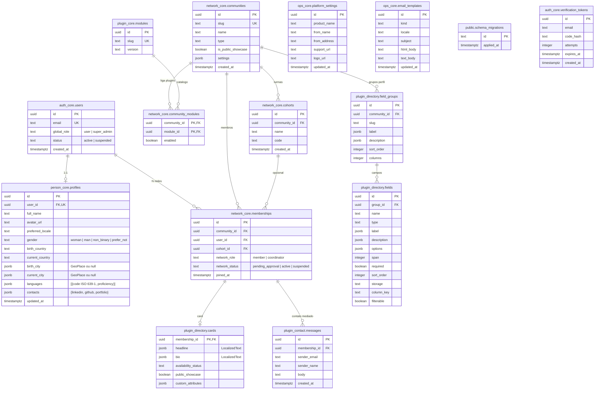

# Community Platform — database

```mermaid
erDiagram
    "auth_core.users" ||--O| "person_core.profiles" : "1:1"
    "auth_core.users" ||--O{ "network_core.memberships" : "N redes"
    "network_core.communities" ||--O{ "network_core.memberships" : "membros"
    "network_core.communities" ||--O{ "network_core.community_modules" : "liga plugins"
    "plugin_core.modules" ||--O{ "network_core.community_modules" : "catalogo"
    "network_core.communities" ||--O{ "network_core.cohorts" : "turmas"
    "network_core.cohorts" ||--O{ "network_core.memberships" : "opcional"
    "network_core.memberships" ||--o| "plugin_directory.cards" : "card"
    "network_core.communities" ||--O{ "plugin_directory.field_groups" : "grupos perfil"
    "plugin_directory.field_groups" ||--O{ "plugin_directory.fields" : "campos"
    "network_core.memberships" ||--O{ "plugin_contact.messages" : "contato mediado"

    "ops_core.platform_settings" {
        uuid id PK
        text product_name
        text from_name
        text from_address
        text support_url
        text logo_url
        timestamptz updated_at
    }

    "ops_core.email_templates" {
        uuid id PK
        text kind
        text locale
        text subject
        text html_body
        text text_body
        timestamptz updated_at
    }

    "public.schema_migrations" {
        text id PK
        timestamptz applied_at
    }

    "auth_core.users" {
        uuid id PK
        text email UK
        text global_role "user | super_admin"
        text status "active | suspended"
        timestamptz created_at
    }

    "auth_core.verification_tokens" {
        uuid id PK
        text email
        text code_hash
        integer attempts
        timestamptz expires_at
        timestamptz created_at
    }

    "person_core.profiles" {
        uuid id PK
        uuid user_id FK, UK
        text full_name
        text avatar_url
        text preferred_locale
        text gender "woman | man | non_binary | prefer_not"
        text birth_country
        text current_country
        jsonb birth_city "GeoPlace ou null"
        jsonb current_city "GeoPlace ou null"
        jsonb languages "[{code ISO 639-1, proficiency}]"
        jsonb contacts "{linkedin, github, portfolio}"
        timestamptz updated_at
    }

    "plugin_core.modules" {
        uuid id PK
        text slug UK
        text version
    }

    "network_core.community_modules" {
        uuid community_id PK, FK
        uuid module_id PK, FK
        boolean enabled
    }

    "network_core.communities" {
        uuid id PK
        text slug UK
        text name
        text type
        boolean is_public_showcase
        jsonb settings
        timestamptz created_at
    }

    "network_core.cohorts" {
        uuid id PK
        uuid community_id FK
        text name
        text code
        timestamptz created_at
    }

    "network_core.memberships" {
        uuid id PK
        uuid community_id FK
        uuid user_id FK
        uuid cohort_id FK
        text network_role "member | coordinator"
        text network_status "pending_approval | active | suspended"
        timestamptz joined_at
    }

    "plugin_directory.cards" {
        uuid membership_id PK, FK
        jsonb headline "LocalizedText"
        jsonb bio "LocalizedText"
        text availability_status
        boolean public_showcase
        jsonb custom_attributes
    }

    "plugin_directory.field_groups" {
        uuid id PK
        uuid community_id FK
        text slug
        jsonb label
        jsonb description
        integer sort_order
        integer columns
    }

    "plugin_directory.fields" {
        uuid id PK
        uuid group_id FK
        text name
        text type
        jsonb label
        jsonb description
        jsonb options
        integer span
        boolean required
        integer sort_order
        text storage
        text column_key
        boolean filterable
    }

    "plugin_contact.messages" {
        uuid id PK
        uuid membership_id FK
        text sender_email
        text sender_name
        text body
        timestamptz created_at
    }
```
