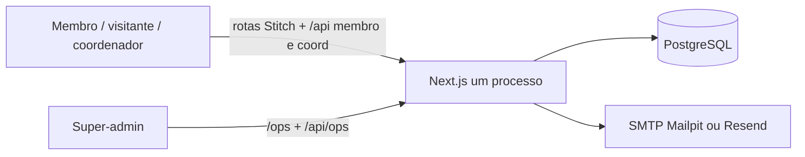

# Alumni Platform — runtime

```mermaid
flowchart LR
    BrowserMember[Membro / visitante / coordenador]
    BrowserOps[Super-admin]
    Next[Next.js um processo]
    PG[(PostgreSQL)]
    SMTP[SMTP Mailpit ou Resend]

    BrowserMember -->|rotas Stitch + /api membro e coord| Next
    BrowserOps -->|/ops + /api/ops| Next
    Next --> PG
    Next --> SMTP
```
