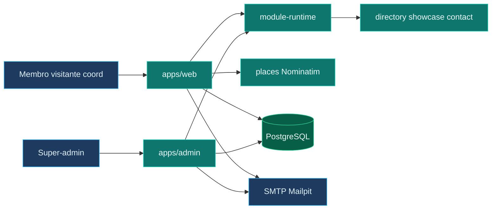

# Community Platform — runtime

```mermaid
flowchart LR
    Member[Membro visitante coord]
    Ops[Super-admin]
    Web[apps/web]
    AdminApp[apps/admin]
    Runtime[module-runtime]
    Places[places Nominatim]
    Plugins[directory showcase contact]
    PG[(PostgreSQL)]
    SMTP[SMTP Mailpit]

    Member --> Web
    Ops --> AdminApp
    Web --> Runtime
    AdminApp --> Runtime
    Web --> Places
    Runtime --> Plugins
    Web --> PG
    AdminApp --> PG
    Web --> SMTP
    AdminApp --> SMTP

    classDef app fill:#0f766e,stroke:#2dd4bf,color:#ecfeff
    classDef store fill:#065f46,stroke:#34d399,color:#ecfdf5
    classDef ext fill:#1e3a5f,stroke:#38bdf8,color:#e0f2fe
    class Web,AdminApp,Runtime,Places,Plugins app
    class PG store
    class SMTP,Member,Ops ext
```
