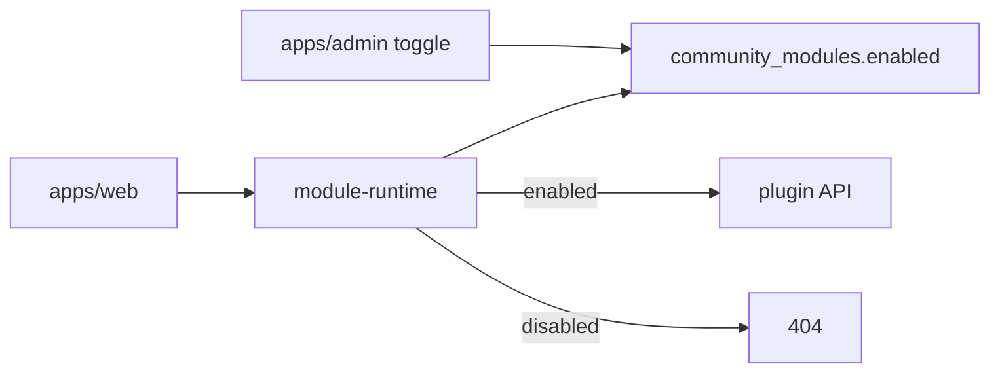

# Module enable flow

```mermaid
flowchart LR
    Admin[apps/admin toggle]
    Table[community_modules.enabled]
    Runtime[module-runtime]
    Web[apps/web]
    Api[plugin API]

    Admin --> Table
    Web --> Runtime
    Runtime --> Table
    Runtime -->|enabled| Api
    Runtime -->|disabled| Four04[404]
```
