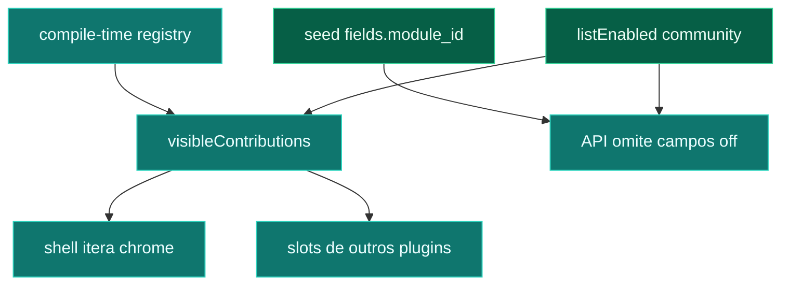

# Plugin contributions

```mermaid
flowchart TD
    Registry[compile-time registry]
    Seed[seed fields.module_id]
    Enabled[listEnabled community]
    Filter[visibleContributions]
    Chrome[shell itera chrome]
    Catalog[API omite campos off]
    Slots[slots de outros plugins]

    classDef app fill:#0f766e,stroke:#2dd4bf,color:#ecfeff
    classDef store fill:#065f46,stroke:#34d399,color:#ecfdf5

    Registry --> Filter
    Enabled --> Filter
    Seed --> Catalog
    Enabled --> Catalog
    Filter --> Chrome
    Filter --> Slots

    class Registry,Filter,Chrome,Slots,Catalog app
    class Seed,Enabled store
```
